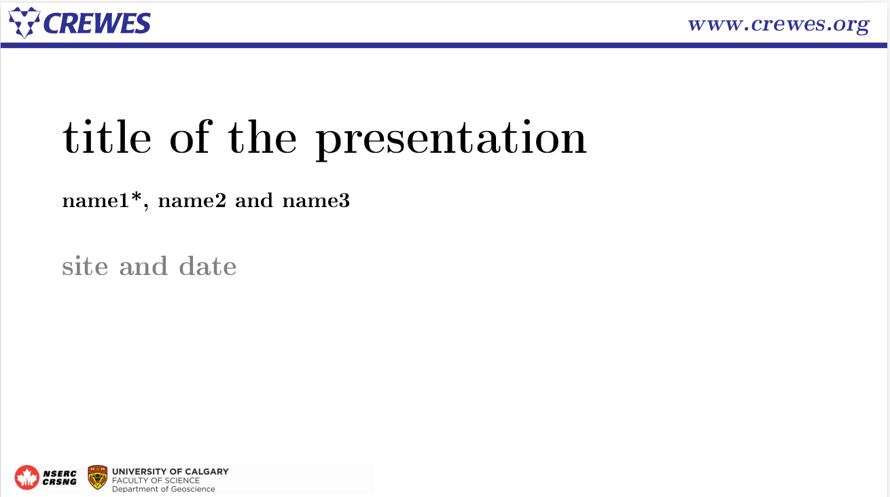
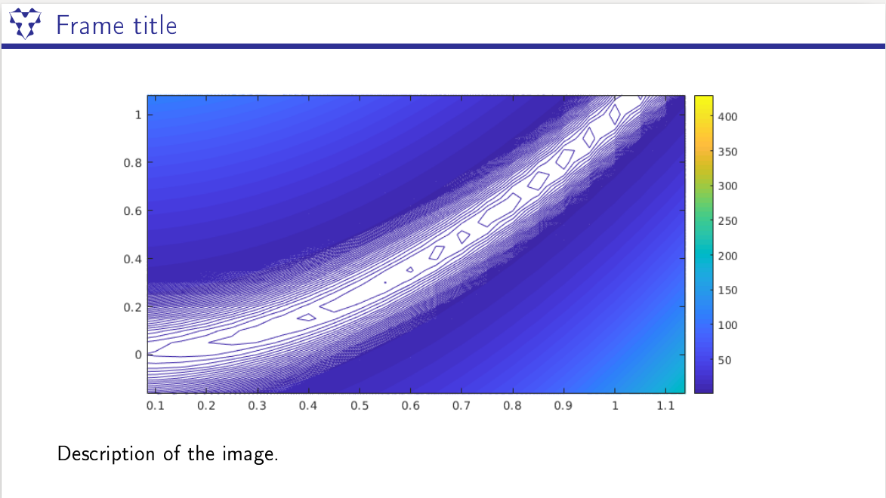
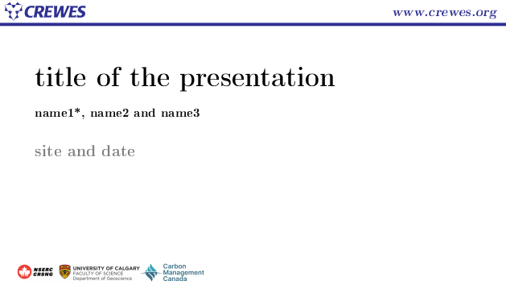
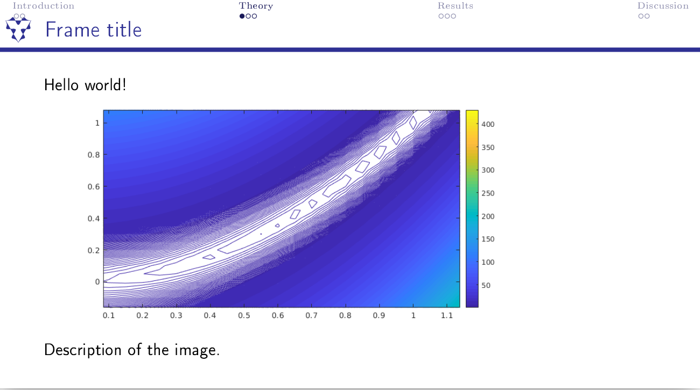

# Beamer package for CREWES presentations
Crewes is [Consortium for Research in Elastic Wave Exploration Seismology](https://www.crewes.org/)

This is the beamer theme to format presentations in the current Crewes format. 

## Title slide example

## Body slide example

## Prerequisites

It has been tested with Linux livetex package. It needs testing in other Latex distributions.

Some drawing is done with latex package Tikz and the logos are rendered with
package graphicx.

## Usage

Use beamer as the document class in the Latex source:

`\documentclass[aspectratio=169]{beamer}`

The aspect ratio should be 16:9 as this is the official Crewes format. 
Other aspect ratios will fail.

If you are not sponsored by CMC, select the crewes theme this way:

`\usetheme{crewes}`

In case you are sponsored by CMC, select the crewes theme this other way:

`\usetheme[cmc]{crewes}`

 

You can also use the miniframes option to have a navigation bar on top of the frames:

`\usetheme[miniframes]{crewes}`

The packages files should be installed in Latex or at least in the
same directory as the presentation.

The rest of the format follows Beamer conventions. See example.

Note: Command `framesubtitle` does not print anything due that the Crewes
format does not have space for a subtitle in the slide.

## Package files

* beamerthemecrewes.sty
* beamerouterthemecrewes.sty
* beamerinnerthemecrewes.sty
* beamerfontthemecrewes.sty
* beamercolorthemecrewes.sty
* Everything inside folder crewesimg

## Example files

* test.tex
* Everything inside folder images

